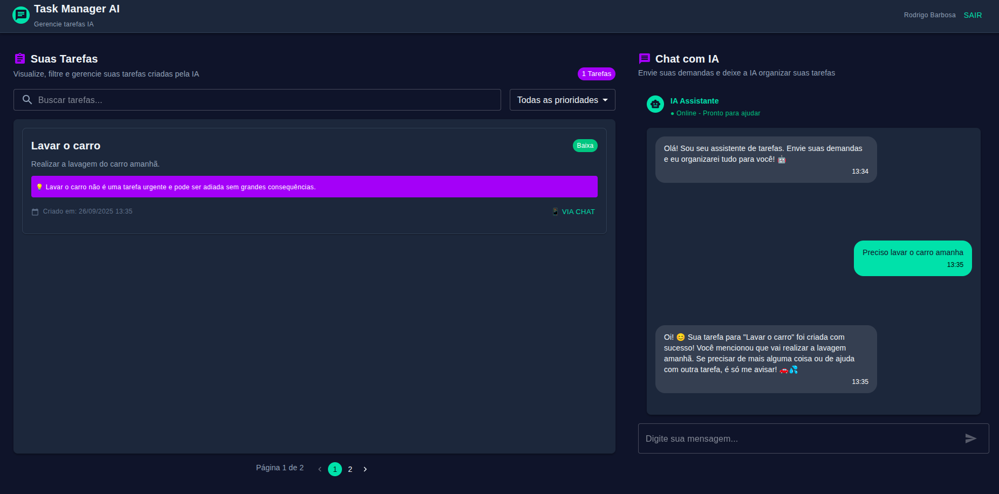

# Chat Task Manager - Frontend

**Chat Task Manager**, um sistema que organiza tarefas recebidas via chat e aplica inteligência artificial para gerar resumos, priorizar tarefas e facilitar a busca semântica.

---

## Layout



---

## Tecnologias Utilizadas

- **React** + **TypeScript**
- **Next.js** para SSR/SSG
- **Material UI** / **Bootstrap** para UI
- **Axios / Fetch** para chamadas à API
- **React Query** (opcional) para cache e estado de dados

---

## Funcionalidades

- Autenticação e controle de acesso
- Lista de tarefas com filtros, busca e paginação
- Exibição de prioridade e justificativa gerada pela IA
- Interação com backend via APIs REST

---

## URLs Importantes

- **Backend API:** `https://api.nimblefast.com.br`
- **Documentação Swagger Backend:** `https://api.nimblefast.com.br/docs`
- **Coverage do backend:** `https://api.nimblefast.com.br/coverage`
- **Deploy Frontend (GitHub Actions):** `https://github.com/rodrigobarbosa12/frontend.chat-tasker.com.br/actions`

---

## Como Rodar Localmente

1. Clone o repositório:

   ```bash
   git clone https://github.com/rodrigobarbosa12/chat-tasker.com.br.git
   cd chat-tasker.com.br
   ```

2. Inicie o container:

   ```bash
   docker compose up -d
   ```
